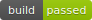

# My Personal site

## Setting up correct githooks for project
$ chmod +x setup\_project.sh
$ ./setup\_project.sh

## Setting up the correct golang binaries

Install:

1. https://github.com/pressly/goose  (For the migrations)

2. Github realize

3. Run go get ./...  (of course, which should fetch the http router, logrus etc.)

## Namecheap setup of dns
for jenkins.denlillemand.com i just did a URL redirect record, which amazingly works okay with the jenkins github plugin.

Then i have the std A Record for host @ with my ip 
and the CNAME record for www pointing to denlillemand.com

## Jenkins
How to handle the fact that it kills everything persistent:
https://wiki.jenkins.io/display/JENKINS/ProcessTreeKiller

## Setting up Jenkins & Github
Hmm ... i used the jenkins package on ubuntu, 
which pretty much gives it to you for free on port 8080.
Just followed the instructions. 

The integration with github is pretty terrible as allways. but i do think when you get over the fact that 
jenkins as an environment where you can generate standard snippets e.g. cloning from github, 
and that the github plugin can generate that id thingy needed its okay. 
I found something out about credentials in jenkins aswell, aparently even though you have created some credentials, if the e.g. github plugin is looking for a speicific kind e.g.  ssh, username/pass or secret text it will not show any of the other credentials you have created. 

## Jenkins and docker
!!! i am not using jenkins/docker right now, i will leave the docker file for future use though. Maybe i will find it funny to run some tests in a docker container. i went back to deploying with foreverjs the key was adding a JENKINS\_NODE\_COOKIE=dontKillMe before calling forever !!!

Nice enough jenkins has built in support for running docker containers.

Remember to run: 

sudo usermod -a -G docker $USER

sudo usermod -a -G docker jenkins

And remember to reboot the VM for jenkins to get the changes and/or restart the SSH connection if you just want to 
run the commands your self

Mainly using: https//jenkins.io/doc/book/pipeline/docker/ as a reference

https://go.cloudbees.com/docs/cloudbees-documentation/cje-user-guide/index.html#docker-workflow

## Installing docker on ubuntu
https://docs.docker.com/engine/installation/linux/docker-ce/ubuntu/#install-docker-ce-1

## Setting up database

1. CREATE DATABASE blog;

2. CREATE USER denlillemand;

3. GRANT ALL PRIVILEGES ON DATABASE blog TO denlillemand;

Remember to log into the 'blog' database before running the following:

4. CREATE EXTENSION IF NOT EXISTS "uuid-ossp";

## Creating migrations
$ goose -dir="migrations" postgres "user=<dbusrname> dbname=<dbname> sslmode=disable"  create <migrationname> <sql|go>

## Setting up SSL when just hosting a golang executable directly
TODO

ref: https://www.kaihag.com/https-and-go/

## Setting up Github build status & test coverage badges with jenkins
For the build status badge i used the jenkins plugin: embeddable-build-status-badges, 
then i changed the security on the jenkins server to matrix-based and for the anonymous user tagged the ones:

1. Overordnet: Read

2. Job: ViewStatus

3. Job: Read

4. Visninger: Read

Then i went into the job, and then inside of the branch(because of i have a multi branch project it is nested further) and 
there is a new icon called embeddable build status blabla, on that page it gives various embeddables that you can copy paste into 
html, markdown etc.

